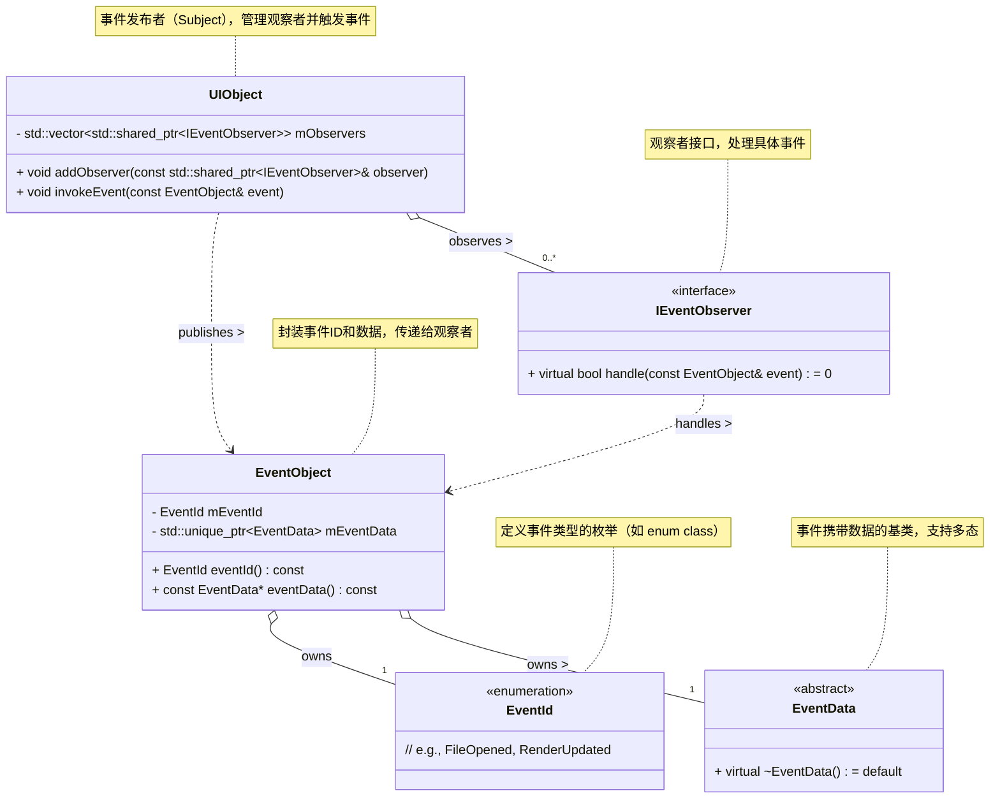

# 事件交互设计模式

在设计交互方式时，没有使用回调的形式，而是使用了vtk中的观察者模式，
下面的设计是参照vtk的observer设计的类图

```mermaid
classDiagram
    class EventId {
        <<enumeration>>
        // e.g., FileOpened, RenderUpdated
    }

    class EventData {
        <<abstract>>
        + virtual ~EventData() = default
    }

    class EventObject {
        - EventId mEventId
        - std::unique_ptr~EventData~ mEventData
        + EventId eventId() const
        + const EventData* eventData() const
    }

    class IEventObserver {
        <<interface>>
        + virtual bool handle(const EventObject& event) = 0
    }

    class UIObject {
        - std::vector~std::shared_ptr~IEventObserver~~ mObservers
        + void addObserver(const std::shared_ptr~IEventObserver~& observer)
        + void invokeEvent(const EventObject& event)
    }

    note for EventId "定义事件类型的枚举（如 enum class）"
    note for EventData "事件携带数据的基类，支持多态"
    note for EventObject "封装事件ID和数据，传递给观察者"
    note for IEventObserver "观察者接口，处理具体事件"
    note for UIObject "事件发布者（Subject），管理观察者并触发事件"

    %% 关系
    EventObject o-- "1" EventData : owns >
    EventObject o-- "1" EventId : owns
    UIObject o-- "0..*" IEventObserver : observes >
    UIObject ..> EventObject : publishes >
    IEventObserver ..> EventObject : handles >

```